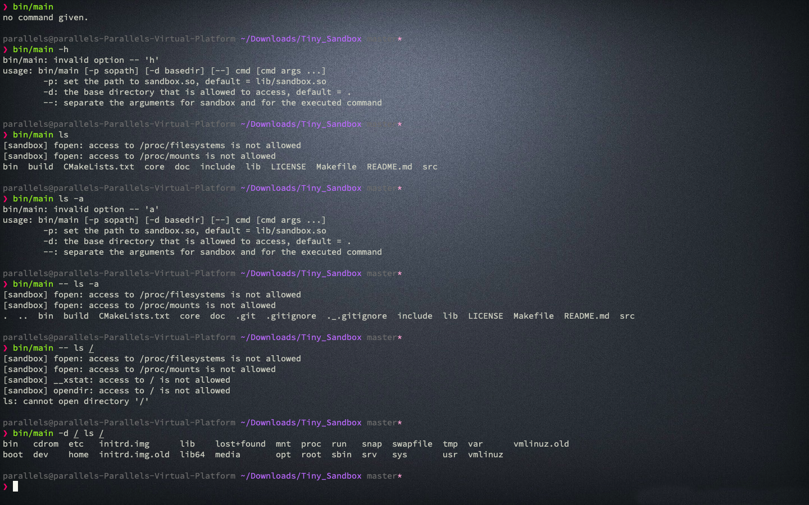
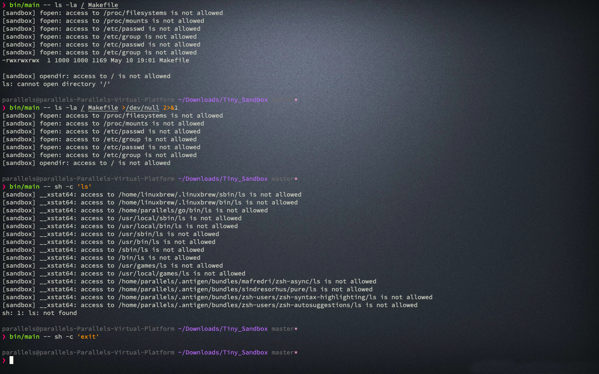

# Ubuntu

<!-- vim-markdown-toc GFM -->

* [使用方式](#使用方式)
    - [編譯](#編譯)
        + [make](#make)
        + [cmake](#cmake)
    - [執行](#執行)
    - [清理](#清理)
* [專案結構](#專案結構)
* [執行結果](#執行結果)

<!-- vim-markdown-toc -->

---

## 使用方式

### 編譯

#### make

```zsh
make
```

#### cmake

-   cmake with make

```zsh
cmake . -DCMAKE_BUILD_TYPE=Release -Bbuild/release && make -C ./build/release
```

-   cmake with ninja

```zsh
cmake . -GNinja -DCMAKE_BUILD_TYPE=Release -Bbuild/release && ninja -C ./build/release
```

### 執行

-   make

```zsh
make run
```

-   exe

```zsh
bin/Netstat_Sim
```

### 清理

```zsh
make clean
```

## 專案結構

```zsh
❯ tree
.
├── CMakeLists.txt
├── LICENSE
├── Makefile
├── README.md
├── bin
│   └── Netstat_Sim
├── build
│   ├── info.o
│   ├── ip.o
│   ├── main.o
│   └── process.o
├── include
│   ├── info.h
│   ├── ip.h
│   ├── main.h
│   └── process.h
└── src
    ├── info.c
    ├── ip.c
    ├── main.c
    └── process.c

4 directories, 17 files
```

## 執行結果

-   show with sudo / no sudo



-   show all



-   show part


-   show with regex filter


